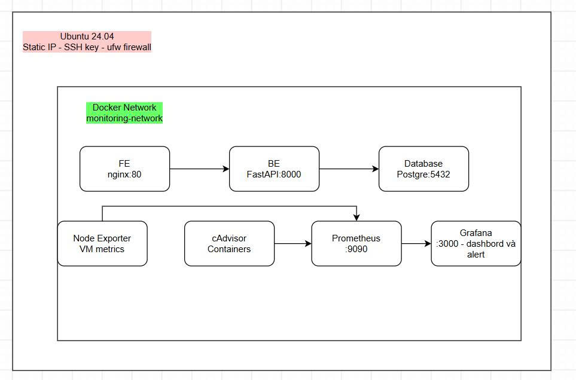

# Notes App - Infra Monitoring

Ứng dụng ghi chú 3-tier (single-user CRUD) được containerize hoàn toàn bằng Docker, kèm hệ thống giám sát hạ tầng thời gian thực bằng Prometheus & Grafana, chạy trên VM Ubuntu.

Dự án được xây dựng nhằm thực hành các kỹ năng cốt lõi của vị trí **System/Cloud Engineer**: Linux, Networking, Docker, Monitoring & Alerting.
## Kiến trúc hệ thống


## Công nghệ sử dụng

| Layer | Công nghệ |
|---|---|
| Hệ điều hành | Ubuntu 24.04 LTS |
| Frontend | HTML, CSS, JavaScript |
| Backend | FastAPI (Python) |
| Database | PostgreSQL 16 |
| Reverse Proxy | Nginx |
| Containerization | Docker, Docker Compose |
| Monitoring | Prometheus, Node Exporter, cAdvisor |
| Visualization & Alerting | Grafana |
| Networking | Static IP (Netplan), SSH key auth, ufw firewall |

## Tính năng

- **CRUD ghi chú đầy đủ**: tạo, xem, sửa, xóa (single-user, không cần đăng nhập)
- **Kiến trúc 3-tier **: Presentation (Nginx) → Application (FastAPI) → Data (PostgreSQL)
- **Container networking**: các service giao tiếp qua tên (service discovery), không dùng IP cứng
- **Giám sát hạ tầng real-time**: CPU, RAM, Disk của VM và của từng container riêng lẻ
- **Alert chủ động**: cảnh báo tự động khi RAM available xuống dưới 20%, đã kiểm thử thực tế bằng `stress-ng`

## Cách chạy dự án

```bash
git clone https://github.com/quangdm006/notes-app-infra-monitoring.git
cd notes-app-infra-monitoring

# Tạo Docker network
docker network create monitoring-net

# Chạy toàn bộ stack
docker compose up -d --build
```

Truy cập:
- Notes App: `http://<VM_IP>`
- Prometheus: `http://<VM_IP>:9090`
- Grafana: `http://<VM_IP>:3000`

## Dashboard Grafana

Dashboard xây dựng gồm 5 panel:

- **RAM Available** — dung lượng RAM còn trống của VM
- **CPU Usage per Container (%)** — mức sử dụng CPU theo từng container
- **Memory Usage per Container** — mức sử dụng RAM theo từng container
- **Disk Free (/)** — dung lượng đĩa còn trống
- **Running Containers** — số container đang hoạt động

## Alert Rule

**Low RAM Available**: cảnh báo khi `node_memory_MemAvailable_bytes / node_memory_MemTotal_bytes * 100 < 20`, duy trì liên tục 2 phút (pending period) để tránh cảnh báo giả do spike tạm thời.

Đã kiểm thử bằng cách tạo tải RAM giả:
```bash
stress-ng --vm 2 --vm-bytes 3200M --timeout 240s
```
Alert chuyển trạng thái **Normal → Pending → Firing** tự động trở về Normal khi RAM hồi phục.

## Bảo mật

- SSH key-based authentication, tắt password login
- ufw firewall chỉ mở đúng port cần thiết (22, 80, 443, 3000, 9090)
- Node Exporter/cAdvisor không expose port ra ngoài, chỉ Prometheus trong cùng Docker network mới truy cập được

